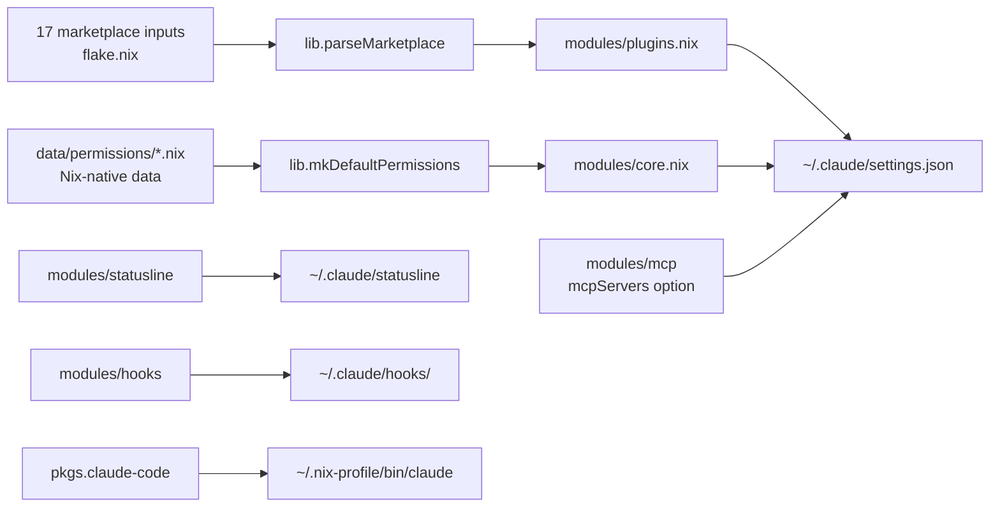

# nix-claude-code

> Declarative Claude Code in Nix — plugins, marketplaces, skills, hooks, MCP,
> and permissions as composable home-manager modules.
> Reproducible on macOS and Linux.

[](https://github.com/JacobPEvans/nix-claude-code/actions/workflows/ci.yml)
[](LICENSE)
[](https://nixos.org)
[](https://github.com/nix-community/home-manager)
[](https://code.claude.com/docs/en/plugins)

A Nix flake that ships [Claude Code](https://www.anthropic.com/claude-code) as composable
home-manager modules. Drop it into your flake — you get a fully-configured Claude Code
with a curated plugin stack, statusline, hooks, MCP servers, and permission rules. All
declared in Nix, reproducible across machines, rolled back with one command.

## What you get

- **All marketplaces, no fiddling.** Anthropic's official marketplaces (`claude-plugins-official`,
  `anthropic-agent-skills`) plus 15+ curated community marketplaces, wired up to refresh automatically.
- **Plugins as data.** Every plugin you enable is declared in `programs.claude.enabledPlugins`,
  version-pinned in `flake.lock`, rolled back atomically with `darwin-rebuild --rollback`.
- **Permissions you can read.** Auto-approved tools, deny lists, and WebFetch allowlist as
  structured Nix data — the same data feeds Codex, Gemini, and any other AI agent you wire up.
- **Statusline themes.** Pick `powerline`, `ccstatusline`, or `daniel3303`'s theme with one option.
- **MCP plumbing.** Surface `programs.claude.mcpServers` from your favorite MCP runtime; we wire
  them into Claude's `settings.json` exactly the way Anthropic specifies.
- **Built on Anthropic's official spec.** Reads `.claude-plugin/marketplace.json` and
  `.claude-plugin/plugin.json` per the [official plugin reference](https://code.claude.com/docs/en/plugins-reference).
  No proprietary formats; no surprises.

## Installation

Add `nix-claude-code` to your flake inputs:

```nix
{
  inputs = {
    nixpkgs.url = "github:NixOS/nixpkgs/nixos-25.11";

    home-manager.url = "github:nix-community/home-manager/release-25.11";
    home-manager.inputs.nixpkgs.follows = "nixpkgs";

    nix-claude-code.url = "github:JacobPEvans/nix-claude-code";
    nix-claude-code.inputs.nixpkgs.follows = "nixpkgs";
    nix-claude-code.inputs.home-manager.follows = "home-manager";
  };
}
```

Or scaffold from a template:

```bash
nix flake init -t github:JacobPEvans/nix-claude-code#minimal
# or, if you already use flake-parts:
nix flake init -t github:JacobPEvans/nix-claude-code#flake-parts
```

## Usage

The simplest setup imports `homeModules.default`:

```nix
{
  outputs = { home-manager, nix-claude-code, nixpkgs, ... }: {
    homeConfigurations."you" = home-manager.lib.homeManagerConfiguration {
      pkgs = nixpkgs.legacyPackages.aarch64-darwin;
      modules = [
        nix-claude-code.homeModules.default
        ({ ... }: {
          home.username = "you";
          home.homeDirectory = "/Users/you";
          home.stateVersion = "25.11";
          programs.claude.enable = true;
        })
      ];
    };
  };
}
```

Then activate:

```bash
nix run home-manager#switch -- --flake .#you
claude   # ready to go
```

### Pick and choose

`homeModules.default` enables everything. Or compose à-la-carte:

| Module                   | What it ships                                                       |
| ------------------------ | ------------------------------------------------------------------- |
| `homeModules.default`    | All of the below, sane defaults — the 95% answer                    |
| `homeModules.claude`     | Alias of `default`                                                  |
| `homeModules.core`       | `settings.json`, permissions, the `claude-code` binary              |
| `homeModules.plugins`    | Marketplace + plugin management                                     |
| `homeModules.statusline` | Powerline / ccstatusline / daniel3303 themes                        |
| `homeModules.hooks`      | Session-output capture + marketplace-refresh hooks                  |
| `homeModules.mcp`        | `programs.claude.mcpServers` option (you populate from any runtime) |
| `homeModules.latest`     | Opt-in auto-installer for the latest Claude Code release            |

Want only permissions, nothing else? Import `homeModules.core` and skip the rest. Want
the plugins but not the statusline? Import `homeModules.core` + `homeModules.plugins`.

### Already on flake-parts?

```nix
{
  outputs = inputs: inputs.flake-parts.lib.mkFlake { inherit inputs; } {
    imports = [ inputs.nix-claude-code.flakeModule ];
    # ...
  };
}
```

## Architecture



See [docs/architecture.md](docs/architecture.md) for the full breakdown.

## API

The `lib.*` exports are designed for any AI-agent tool that wants to consume Claude-spec data:

```nix
{ inputs, lib, ... }:
let
  market = inputs.nix-claude-code.lib.parseMarketplace inputs.jacobpevans-cc-plugins;
  # market :: { name; description; owner; plugins; raw; }

  skills = inputs.nix-claude-code.lib.discoverSkills inputs.anthropic-agent-skills;
  # skills :: [{ name; path; pluginRoot; }]

  perms = inputs.nix-claude-code.lib.mkDefaultPermissions { tool = "codex"; };
  # perms :: { allow; ask; deny; webfetchDomains; }
in
  # ... build whatever you need
```

| Lib export                                              | Purity | Returns                                                              |
| ------------------------------------------------------- | ------ | -------------------------------------------------------------------- |
| `lib.parseMarketplace`                                  | pure   | `{ name; description; owner; plugins; raw; }`                        |
| `lib.parsePlugin`                                       | pure   | `{ name; description; version; author; raw; }`                       |
| `lib.discoverSkills`                                    | pure   | `[{ name; path; pluginRoot; }]`                                      |
| `lib.discoverCommands`                                  | pure   | `[{ name; path; pluginRoot; }]`                                      |
| `lib.discoverAgents`                                    | pure   | `[{ name; path; pluginRoot; frontmatter; }]`                         |
| `lib.discoverHooks`                                     | pure   | `hooks.json` attrset                                                 |
| `lib.toSettingsJson`                                    | pure   | `~/.claude/settings.json` shape                                      |
| `lib.permissions.{allow,ask,deny,domains,toolSpecific}` | data   | Permission lists                                                     |
| `lib.mkDefaultPermissions`                              | pure   | Composed permissions for a tool                                      |
| `lib.wrapCommandsAsSkills { pkgs }`                     | impure | Derivation wrapping `commands/<name>.md` as synthetic SKILL.md files |

## Compatibility

| Component    | Supported                                                                    |
| ------------ | ---------------------------------------------------------------------------- |
| Claude Code  | latest stable (auto-tracked from Anthropic upstreams)                        |
| nixpkgs      | `nixos-25.11` (override via `inputs.nix-claude-code.inputs.nixpkgs.follows`) |
| home-manager | `release-25.11`                                                              |
| Platforms    | `aarch64-darwin`, `x86_64-darwin`, `aarch64-linux`, `x86_64-linux`           |
| Plugin spec  | [Anthropic official](https://code.claude.com/docs/en/plugins-reference)      |

## Comparison

|                                    | nix-claude-code  | Hand-maintained `.claude/` |
| ---------------------------------- | ---------------- | -------------------------- |
| Reproducible across machines       | ✓                | ✗                          |
| Atomic rollback                    | ✓ (`--rollback`) | ✗                          |
| Version-pinned plugins             | ✓ (`flake.lock`) | ✗                          |
| Auto-refresh marketplaces          | ✓ (opt-in hook)  | manual                     |
| One-command setup on a new machine | ✓                | hours of `/plugin install` |
| Anthropic plugin spec compliant    | ✓                | depends on what you wrote  |

## Contributing

- **Add a marketplace**: append to `flake.nix` inputs and the wiring in `flake/modules.nix`.
- **Add a statusline theme**: drop a `<name>.nix` file in `modules/statusline/`.
- **Add a permission rule**: edit `data/permissions/*.nix`. These are the **source of truth** for
  permission rules across all AI agent tools, not just Claude.
- **Add a lib helper**: write a pure function in `lib/`, add a `nix-unit` test in `checks/lib/`.

Pre-commit hooks run `treefmt`, `deadnix`, `statix`, and YAML/TOML validation. CI runs
`nix flake check` on every PR.

See [docs/adopters.md](docs/adopters.md) for the full integration guide.

## License

MIT © Jacob P. Evans — see [LICENSE](LICENSE).

## Related

- [JacobPEvans/nix-ai](https://github.com/JacobPEvans/nix-ai) — multi-tool AI workspace
  (Claude, Gemini, Codex, Copilot, MCP, MLX) that consumes this flake.
- [JacobPEvans/nix-home](https://github.com/JacobPEvans/nix-home) — user dev environment in Nix.
- [JacobPEvans/nix-devenv](https://github.com/JacobPEvans/nix-devenv) — reusable devshells.
- [anthropics/claude-code](https://github.com/anthropics/claude-code) — Claude Code itself.
- [anthropics/claude-plugins-official](https://github.com/anthropics/claude-plugins-official) —
  Anthropic's official plugin marketplace.
