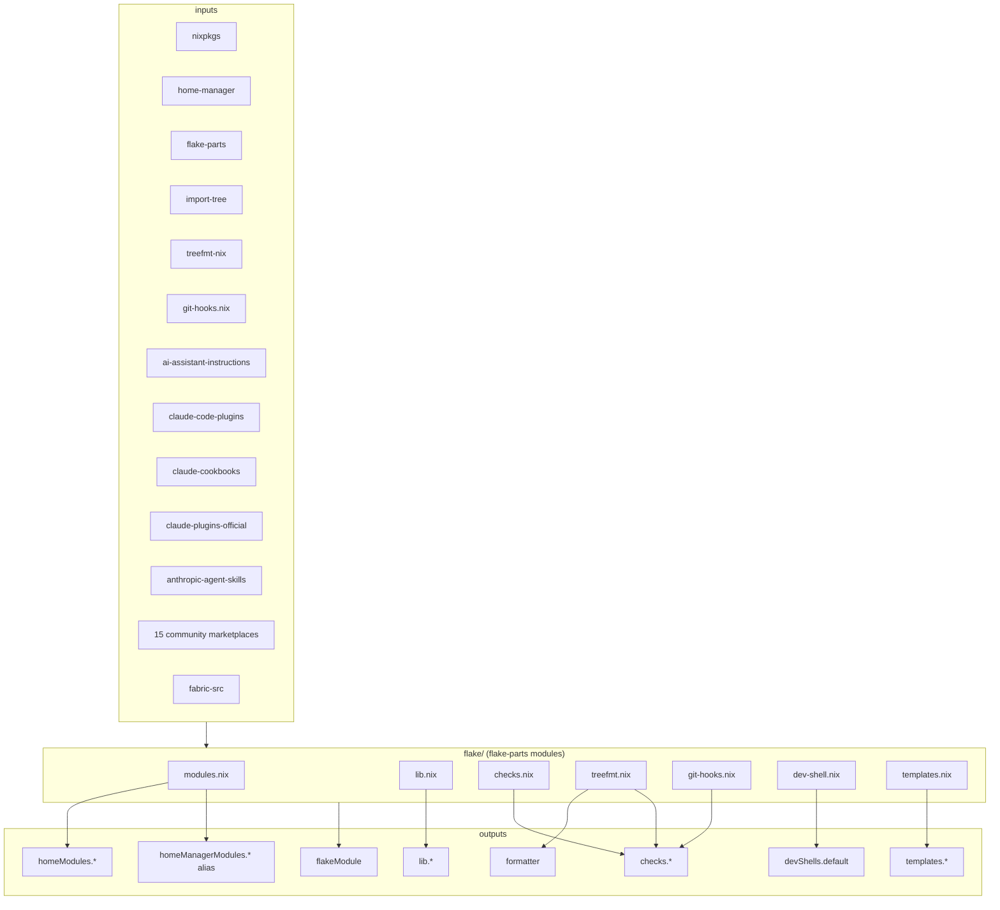
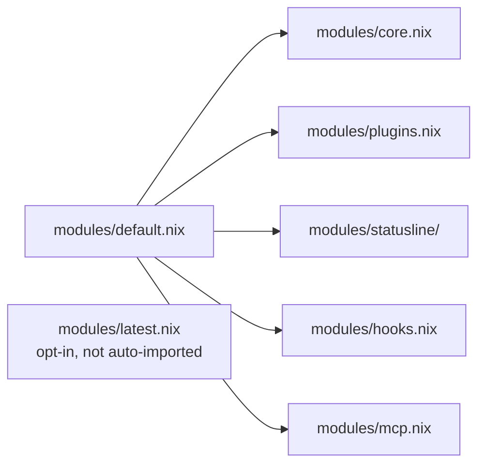

# Architecture

## Inputs → outputs



## Module composition

`homeModules.default` imports all feature modules. Each feature module:

1. Defines its option schema under `programs.claude.<feature>.*`.
2. Guards real configuration behind `config = lib.mkIf cfg.enable { ... };`.
3. Reads its inputs from `_module.args` (wired by `flake/modules.nix`).



## Lib organization

`lib/default.nix` is the public entry point. It re-exports:

- **Parsers** (`parseMarketplace`, `parsePlugin`) — pure, read Anthropic-spec JSON.
- **Discoverers** (`discoverSkills`, `discoverCommands`, `discoverAgents`,
  `discoverHooks`) — pure, walk plugin trees, return structured data.
- **Wrappers** (`wrapCommandsAsSkills`) — impure, needs `pkgs.runCommand`, synthesizes
  derivations.
- **Permissions** (`permissions.*`, `mkDefaultPermissions`) — re-exports `data/permissions/`
  as Nix data.
- **Serializers** (`toSettingsJson`) — formats option values into Anthropic's settings.json
  schema.

Pure vs. impure is split intentionally so consumers that don't need command-wrapping
don't drag `pkgs` into call sites.

## Permission data layout

```text
data/permissions/
├── allow.nix         # Auto-approved actions, mirrors ai-assistant-instructions/permissions/allow/
├── ask.nix           # Prompt-before-execute actions
├── deny.nix          # Hard-denied actions
├── domains.nix       # Per-feature domain allowlists (WebFetch)
└── tool-specific.nix # Per-tool overrides (claude/codex/gemini)
```

The data is structured Nix, not JSON. `lib.permissions.*` re-exports each
file; `lib.mkDefaultPermissions` composes them for a given tool.

## Pre-v1 forever versioning

`release-please-config.json` sets `bump-minor-pre-major: true` and
`bump-patch-for-minor-pre-major: true`:

- `feat:` / `fix:` → patch bump (`0.1.0` → `0.1.1`)
- `feat!:` / `fix!:` → minor bump (`0.1.0` → `0.2.0`)
- Major version never auto-bumps

To eventually reach v1.0.0, a human edits `release-please-config.json` to
remove the `bump-minor-pre-major` flag.

## Testing layout

```text
checks/
└── lib/
    ├── parse-marketplace.nix     # nix-unit test for lib.parseMarketplace
    ├── discover-skills.nix       # nix-unit test for lib.discoverSkills
    └── ...                       # one per lib function (added in Checkpoint 1)
```

`flake/checks.nix` wires these into per-system `checks.*` outputs. `nix flake check`
runs all of them, plus treefmt + pre-commit + module-eval regression.
