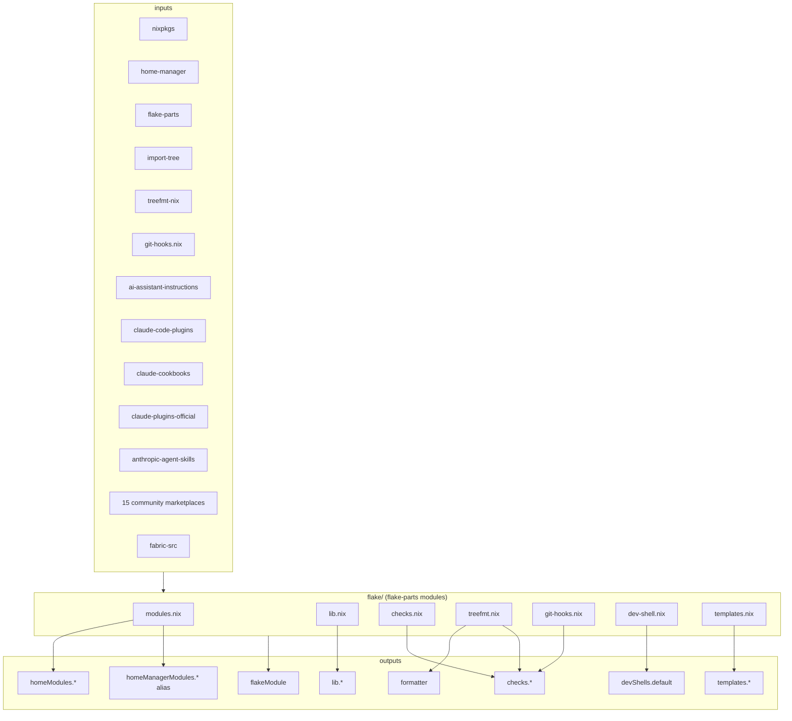
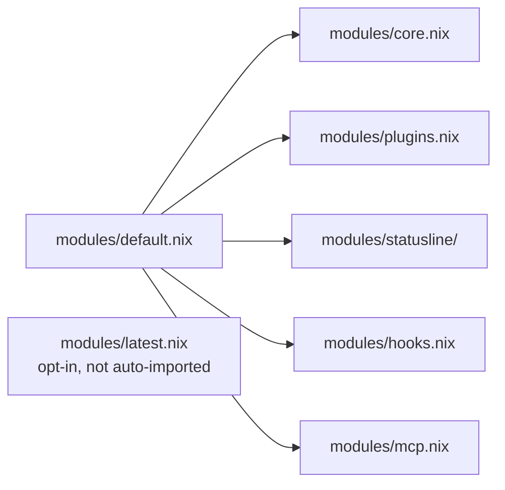

# Architecture

## Inputs → outputs


```mermaid
flowchart TB
    subgraph inputs
        N[nixpkgs]
        HM[home-manager]
        FP[flake-parts]
        IT[import-tree]
        TF[treefmt-nix]
        GH[git-hooks.nix]
        AAI[ai-assistant-instructions]
        CCP[claude-code-plugins]
        CCK[claude-cookbooks]
        CPO[claude-plugins-official]
        AAS[anthropic-agent-skills]
        MK[15 community marketplaces]
        FS[fabric-src]
    end

    subgraph flake_parts ["flake/ (flake-parts modules)"]
        FM[modules.nix]
        FL[lib.nix]
        FC[checks.nix]
        FT[treefmt.nix]
        FGH[git-hooks.nix]
        FDS[dev-shell.nix]
        FTP[templates.nix]
    end

    subgraph outputs
        HMM[homeModules.*]
        HMMa[homeManagerModules.* alias]
        LIB[lib.*]
        FLM[flakeModule]
        CHK[checks.*]
        FMT[formatter]
        DS[devShells.default]
        TPL[templates.*]
    end

    inputs --> flake_parts
    FM --> HMM
    FM --> HMMa
    FL --> LIB
    FC --> CHK
    FT --> FMT
    FT --> CHK
    FGH --> CHK
    FDS --> DS
    FTP --> TPL
    flake_parts --> FLM
```

## Module composition

`homeModules.default` imports all feature modules. Each feature module:

1. Defines its option schema under `programs.claude.<feature>.*`.
2. Guards real configuration behind `config = lib.mkIf cfg.enable { ... };`.
3. Reads its inputs from `_module.args` (wired by `flake/modules.nix`).


```mermaid
flowchart LR
    D[modules/default.nix] --> C[modules/core.nix]
    D --> P[modules/plugins.nix]
    D --> S[modules/statusline/]
    D --> H[modules/hooks.nix]
    D --> M[modules/mcp.nix]
    L[modules/latest.nix<br/>opt-in, not auto-imported]
```

## Lib organization

`lib/default.nix` is the public entry point. It re-exports:

- **Parsers** (`parseMarketplace`, `parsePlugin`) — pure, read Anthropic-spec JSON.
- **Discoverers** (`discoverSkills`, `discoverCommands`, `discoverAgents`,
  `discoverHooks`) — pure, walk plugin trees, return structured data.
- **Wrappers** (`wrapCommandsAsSkills`) — impure, needs `pkgs.runCommand`, synthesizes
  derivations.
- **Permissions** (`permissions.*`, `mkDefaultPermissions`) — re-exports `data/permissions/`
  as Nix data.
- **Serializers** (`toSettingsJson`) — formats option values into Anthropic's settings.json
  schema.

Pure vs. impure is split intentionally so consumers that don't need command-wrapping
don't drag `pkgs` into call sites.

## Permission data layout

```text
data/permissions/
├── allow.nix         # Auto-approved actions, mirrors ai-assistant-instructions/permissions/allow/
├── ask.nix           # Permanently empty — an ask stalls unattended runs
├── deny.nix          # Hard-denied actions (catastrophic only)
├── domains.nix       # Per-feature domain allowlists (WebFetch)
└── tool-specific.nix # Per-tool overrides (claude/codex/gemini)
```

The data is structured Nix, not JSON. `lib.permissions.*` re-exports each
file; `lib.mkDefaultPermissions` composes them for a given tool.

**Claude Code does not consume this data.** The home-manager modules render
`permissions.allow`, `.ask`, and `.deny` as empty lists and set
`permissions.defaultMode = "auto"`, so the auto-mode classifier is the only
gate — see [settings.md](settings.md#permissions-full-trust-auto-mode). The
data remains the source of truth for agents that have no classifier of their
own (Codex, Gemini), which consume it through `lib.mkDefaultPermissions` in
nix-ai.

## Pre-v1 forever versioning

`release-please-config.json` sets `bump-minor-pre-major: true` and
`bump-patch-for-minor-pre-major: true`:

- `feat:` / `fix:` → patch bump (`0.1.0` → `0.1.1`)
- `feat!:` / `fix!:` → minor bump (`0.1.0` → `0.2.0`)
- Major version never auto-bumps

To eventually reach v1.0.0, a human edits `release-please-config.json` to
remove the `bump-minor-pre-major` flag.

## Plugin cache lifecycle

When Nix repoints a marketplace symlink at a new store path, the plugins
installed from the old path are stale. Two scripts handle that, and neither
deletes anything:

- `modules/scripts/verify-cache-integrity.sh` compares the `readlink` string of
  each marketplace symlink against a recorded hash and writes a
  `.nix-refresh-needed` marker on a change.
- `modules/hooks/marketplace-refresh.sh` consumes the marker at session start,
  refreshes the marketplace index, and reinstalls only the enabled plugins whose
  recorded `installPath` no longer exists.

Reclaiming superseded cache directories is Claude Code's own job. It refcounts
every `cache/<marketplace>/<plugin>/<version>/` with `.in_use/<pid>`, tombstones
an unreferenced one with `.orphaned_at`, deletes it only after a grace period,
and defers any overwrite or relink of a directory a live session still holds.
Side-by-side versions are the supported state, not a leak.

### Recovering a session with a dangling installPath

A session resolves plugin paths at startup, and hooks re-stat
`${CLAUDE_PLUGIN_ROOT}` on every invocation, so a session that was running
across a version change can report `Plugin directory does not exist`. Skill
bodies are read into memory at load and keep working; a skill's bundled
resources (`references/`, `scripts/`) are read at use time and fail the same
way.

Run `/reload-plugins` in the affected session. It re-resolves paths in place,
touches no cache directory, and does not require restarting the session.

## Testing layout

```text
checks/
└── lib/
    ├── parse-marketplace.nix     # nix-unit test for lib.parseMarketplace
    ├── discover-skills.nix       # nix-unit test for lib.discoverSkills
    └── ...                       # one per lib function (added in Checkpoint 1)
```

`flake/checks.nix` wires these into per-system `checks.*` outputs. `nix flake check`
runs all of them, plus treefmt + pre-commit + module-eval regression.
